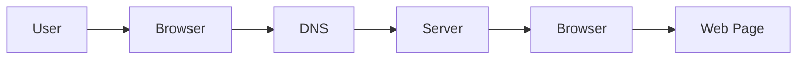

*********Prompt i used to summarize udemy cours using Merlin AI************** 
"iam learning web development. summarize the key concepts from this udemy lesson in simple bullet points i can save as studey notes"

*****
# AI Prompt: Generate Study Notes from Course Transcript

## Role

Act as a senior technical educator and documentation writer.

## Task

Read the provided course transcript and generate concise, well-structured study notes that answer only the specified lesson questions.

## Inputs

### Lesson Questions

```
<Insert lesson questions here>

Example:

L1: What is Web Development?
L2: What is Full Stack Web Development?
L3: How Does the Internet Work (HTTP, DNS, Client-Server)?
```

### Transcript

```
<Paste the transcript here>
```

---

## Instructions

* Extract only information that answers the lesson questions.
* Ignore greetings, repetition, filler words, examples that don't teach the concept, and promotional content.
* Rewrite everything in your own words.
* Keep explanations beginner friendly.
* Preserve technical accuracy.
* Do not invent information that is not present in the transcript.
* If a concept is mentioned briefly, expand it only enough to improve understanding without introducing unrelated topics.

---

## Output Format

Return **only valid GitHub Markdown**.

For each lesson use this structure:

```markdown
# L1: Lesson Title

## Definition

Provide a clear one or two sentence explanation.

---

## Key Concepts

### Concept Name

Explain the concept.

Use bullet points when appropriate.

---

## Important Terms

| Term | Meaning |
|------|---------|

---

## Key Takeaways

- Point 1
- Point 2
- Point 3

---

## Quick Revision

- Short bullet points for fast revision.
```

---

## Formatting Rules

* Use Markdown headings (`#`, `##`, `###`).
* Use bullet lists instead of long paragraphs.
* Use numbered lists only for sequences or steps.
* Use Markdown tables for comparisons and terminology.
* Use blockquotes (`>`) only for important notes.
* Use fenced code blocks only for commands, URLs, HTTP examples, JSON, or diagrams.
* Use horizontal rules (`---`) between major sections.
* Keep paragraphs short (2–4 lines maximum).
* Use bold only for key terms.

---

## If the lesson contains a process

Represent it as a Mermaid flowchart.

Example:

````markdown

````

---

## If comparisons exist

Use a Markdown table.

Example:

| Frontend       | Backend      |
| -------------- | ------------ |
| User Interface | Server Logic |
| HTML           | Node.js      |
| CSS            | Express      |
| JavaScript     | MongoDB      |

---

## End Every Lesson With

### Interview Questions

* Question 1
* Question 2
* Question 3

### Common Mistakes

* Mistake 1
* Mistake 2

### Key Takeaways

* Most important point 1
* Most important point 2
* Most important point 3

### Quick Revision

* One-line summary bullets for rapid review.

---

## Goal

Produce clean, professional, GitHub-ready Markdown notes that can be committed directly into a `.md` file without any editing.

*****

*********Notes from gen ai prompting*******************
"Here are the key concepts from the Udemy lesson on general-purpose prompting for developers:

Step-by-Step Method: Ask the AI to break down complex questions into smaller, manageable steps for a structured response. Useful for understanding intricate processes like algorithms.
Role-Specific Prompting: Assign a role (e.g., teacher, expert, programmer) to the AI to get precise, expert-level answers.
Context-Based Prompting: Provide a scenario or context before your question to help the AI generate more relevant and specific responses.
Comparative Prompting: Ask the AI to compare two or more concepts, systems, or approaches, highlighting their differences and similarities to evaluate trade-offs.
Pros and Cons Prompting: Request both the advantages and disadvantages of a concept or technology for a balanced view, aiding in decision-making.
Specific Length Prompting: Direct the AI to limit or expand its answer based on desired detail, specifying word count, sentence length, or depth for concise or detailed responses.
Hypothetical Scenario Prompting: Use imagined contexts to explore potential challenges or applications of technology in unique situations.
Chain of Thought Prompting: Ask the AI to "think out loud" and explain its reasoning process step-by-step to reach a conclusion, ideal for understanding complex techniques.
Explain Like I'm Five (ELI5): Request complex concepts to be explained in simple, easy-to-understand terms, often using analogies, great for learning new or difficult topics.
Problem-Solving Prompting: Present a problem and ask the AI for potential solutions, focusing on practical applications and real-world use cases for addressing coding challenges.
Critical Thinking Prompting: Ask the AI to analyze, critique, or question a concept to elicit more in-depth and evaluated responses, useful for assessing best practices.
Historical Comparison Prompting: Compare modern techniques with past technologies to provide perspective on progress and relevance, good for understanding the evolution of languages or frameworks.
Data-Driven Prompting: Ask the AI to reference or incorporate data, statistics, or research findings for factual, research-backed insights.
Open-Ended Prompting: Frame questions broadly to encourage the AI to explore multiple angles and interpretations, useful for generating a wide range of perspectives."
***** Key Concepts from Web Develpoment************
# L1: What is Web Development

## Definition

**Web Development** is the process of creating, building, and maintaining websites or web applications that run on the internet.

Its goals are to:

- Build websites and web applications
- Ensure they function properly
- Load quickly
- Provide a user-friendly experience
- Work across different devices

---

## Main Parts of Web Development

Web development consists of two major parts:

### 1. Frontend (Client Side)

The frontend is everything users **see and interact with** in a web browser.

#### Technologies Used

##### HTML (HyperText Markup Language)

- Creates the structure of a webpage
- Defines:
  - Headings
  - Paragraphs
  - Images
  - Links
  - Forms

**Remember:** HTML is the **skeleton** of a webpage.

---

##### CSS (Cascading Style Sheets)

- Styles the webpage
- Controls:
  - Colors
  - Fonts
  - Layout
  - Spacing
  - Responsive Design

**Remember:** CSS is the **appearance** of a webpage.

---

##### JavaScript

- Adds interactivity
- Makes webpages dynamic

Examples:

- Form validation
- Animations
- Buttons
- Live updates
- Dropdown menus

**Remember:** JavaScript is the **brain** of the webpage.

---

### 2. Backend (Server Side)

The backend handles everything users cannot see.

Responsibilities include:

- Processing requests
- Business logic
- Authentication
- Managing databases
- Sending data to the frontend

---

## Backend Technologies

### Node.js

- JavaScript Runtime Environment
- Allows JavaScript to run outside the browser

> **Important:** Node.js is **NOT** a programming language.

---

### Databases

Examples:

- MongoDB
- MySQL
- PostgreSQL

Used to store:

- Users
- Products
- Orders
- Application Data

---

### APIs (Application Programming Interfaces)

Allow communication between:

- Frontend ↔ Backend
- Website ↔ External Services

---

### Version Control

Used to:

- Track changes
- Collaborate with developers
- Restore previous versions

Popular tools:

- Git
- GitHub

---

## Key Points

- Web Development = Frontend + Backend
- Frontend uses HTML, CSS and JavaScript.
- Backend uses Node.js, databases and APIs.
- Git is used for version control.

---

# L2: What is Full Stack Web Development

## Definition

A **Full Stack Developer** builds both the frontend and backend of a web application.

---

## Frontend Technologies

- HTML
- CSS
- JavaScript
- React

---

## Backend Technologies

- Node.js
- Express.js

---

## Database

- MongoDB

---

## MERN Stack

| Technology | Purpose |
|------------|---------|
| MongoDB | Database |
| Express.js | Backend Framework |
| React | Frontend Library |
| Node.js | JavaScript Runtime |

---

## Why MERN?

### One Programming Language

JavaScript is used for:

- Frontend
- Backend

Benefits:

- Easier learning
- Faster development
- Reuse JavaScript everywhere

---

## Career Paths

After learning MERN, you can become:

- Frontend Developer
- Backend Developer
- Full Stack Developer
- MongoDB Database Administrator
- DevOps Engineer (additional skills required)

---

## Key Points

- Full Stack = Frontend + Backend
- MERN = MongoDB + Express + React + Node.js
- JavaScript is used across the entire stack.

---

# L3: How Does the Internet Work?

## Step 1: User Requests a Website

The user enters a URL into the browser.

Example:

`https://youtube.com`

---

## Step 2: DNS Lookup

**DNS (Domain Name System)** converts a domain name into an IP address.

Example:

```
youtube.com
      ↓
142.xxx.xxx.xxx
```

Think of DNS as the **Internet's phonebook**.

---

## Step 3: HTTP Request

The browser sends an **HTTP Request** to the server.

HTTP = **HyperText Transfer Protocol**

Used for communication between:

- Client
- Server

---

## Step 4: Server Response

The server processes the request and sends back:

- HTML
- CSS
- JavaScript
- Images
- Videos
- Other resources

This is called an **HTTP Response**.

---

## Step 5: Browser Renders the Page

The browser:

- Reads HTML
- Applies CSS
- Executes JavaScript
- Displays the webpage

The user can now interact with the website.

---

# Client-Server Model

## Client

The user's browser.

Examples:

- Chrome
- Edge
- Firefox
- Safari

Requests information from the server.

---

## Server

A computer that stores website files and responds to client requests.

Responsibilities:

- Process requests
- Retrieve data
- Send responses

---

# Internet Flow

```text
User
  │
  ▼
Browser (Client)
  │
  ▼
DNS Server
  │
  ▼
Web Server
  │
HTTP Response
  │
  ▼
Browser
  │
  ▼
Web Page Displayed
```

---

# Key Terms

| Term | Meaning |
|------|---------|
| Internet | Global network connecting devices |
| Client | Browser requesting data |
| Server | Computer providing website resources |
| DNS | Converts domain names into IP addresses |
| HTTP | Protocol used to transfer web data |
| Request | Client asks for data |
| Response | Server sends data |
| Rendering | Browser displays the webpage |

---

# Quick Revision

## L1

- Web Development creates websites and web applications.
- Frontend = HTML + CSS + JavaScript
- Backend = Node.js + Databases + APIs
- Git tracks code changes.

---

## L2

- Full Stack = Frontend + Backend
- MERN = MongoDB + Express + React + Node.js
- JavaScript is used throughout the stack.

---

## L3

- User enters URL.
- DNS finds the IP address.
- Browser sends an HTTP request.
- Server returns files.
- Browser renders the webpage.